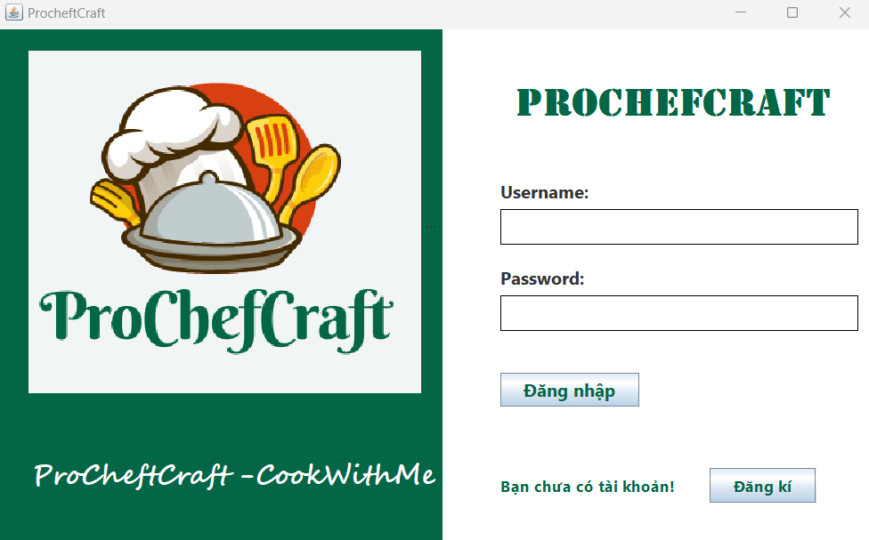
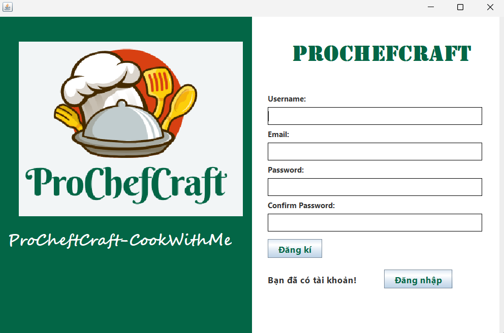
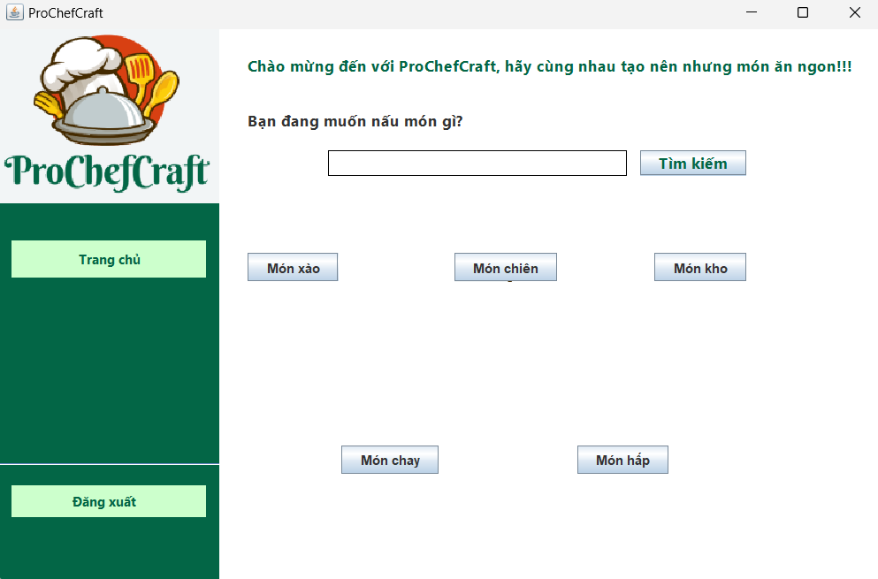
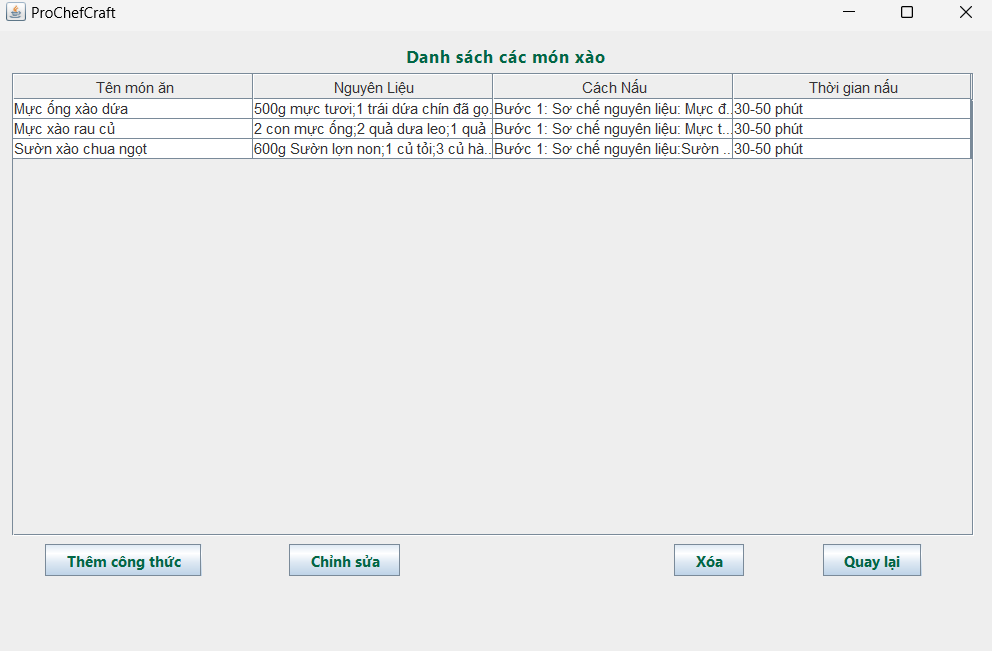

# [ProChefCraft-CookWithMe]

Ứng dụng ProChefCraft là một công cụ độc đáo và hữu ích dành cho những người đam mê nấu ăn và mong muốn khám phá và trổ tài trong nghệ thuật nấu nướng. Với giao diện thân thiện và chức năng đa dạng, ứng dụng này cung cấp cho bạn hàng ngàn công thức món ăn ngon từ khắp nơi trên thế giới, cùng với hướng dẫn chi tiết và những bí quyết từ các đầu bếp chuyên nghiệp. Bất kể bạn là người mới bắt đầu hay là đầu bếp có kinh nghiệm, Ứng dụng ProChefCraft vời sẽ giúp bạn trở thành một đầu bếp tài ba.


## Authors

- [@keymon04](https://github.com/K3ynom4)


## Demo

[Link Video Demo](https://www.youtube.com/watch?v=JYU1olz0Nxk)


## Screenshots

Ảnh
   


## Features

- Đăng kí, đăng nhập vào ứng dụng
- Xem được danh sách các công thức nấu ăn
- Thêm, sửa, xóa công thức
- Tính năng tìm kiếm vẫn đang trong giai đoạn hoàn thiện


## Requirements

- Java 11
- Maven 3.6.3
- 


## Installation

Cách cài đặt dự án

```bash
  - Clone dự án
  - Mở terminal và chạy lệnh: mvn clean install
  - Chạy ứng dụng

  - Down file jar từ ...
  - Chạy file jar
```
    

## License

[MIT](https://choosealicense.com/licenses/mit/)

